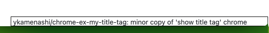

# chrome-ex-my-title-tag ページタイトルを右下に出すアドオン

minor reproduction of 'show title tag' chrome addon.

元ネタ: [Chromeアドオン Show Title Tag](https://chromewebstore.google.com/detail/show-title-tag/pkbffbhglicfngmppdlpmpblfgnkdgio?hl=JA)

Chromeアドオン Show Title Tag がManifest V3に未対応で使えなくなったので、自分用に作った代替品です。

## 使い方

リポジトリをローカルにクローン後、Chromeの拡張機能管理画面から「パッケージ化されていない拡張機能を読み込む」を押して、フルパスを指定してください。

## Tips

このアドオンが邪魔で隠れた要素がクリックできない時は、ダブルクリックしてください。消えます。

もう一度表示したい時は、ページをリロードしてください。